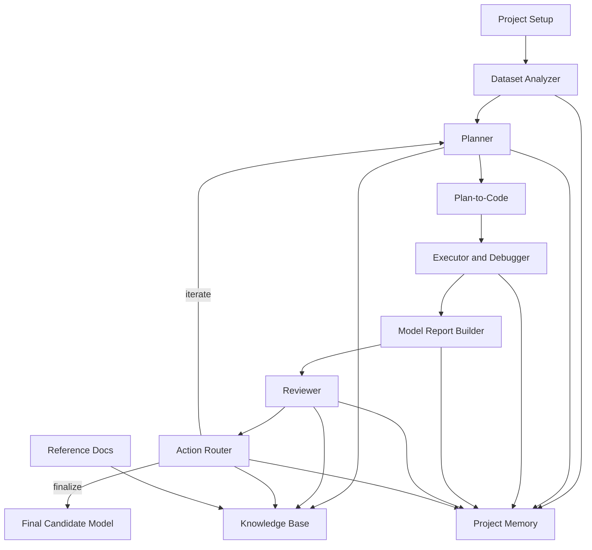

# System Architecture

## Goal

Define the first reliable operating model for Agentic AutoML so implementation can begin with stable interfaces and a clean repository shape.

## Architectural Position

The product should be designed as an orchestrated loop with deterministic analysis and reporting components wrapped by narrow, role-specific agents. The system is not a single autonomous blob. It is a controlled workflow where each stage emits artifacts that become the inputs to the next stage.

## Core Loop



## Logical Layers

### 1. Orchestration layer

Responsibilities:

- manage project runs and iteration order
- invoke the right agent or deterministic tool
- enforce retry limits and approval boundaries
- maintain the current experiment state

Examples:

- main run command
- iteration controller
- state loader and saver

### 2. Deterministic analysis layer

Responsibilities:

- profile datasets
- calculate metrics
- build plots and summaries
- validate schemas and artifacts

Examples:

- dataset profiler scripts
- evaluation scripts
- artifact validators

### 3. Agent layer

Responsibilities:

- interpret structured inputs
- propose actions
- write plans
- generate or revise code
- review outcomes

Examples:

- planner
- plan-to-code
- reviewer
- action router

### 4. Knowledge layer

Responsibilities:

- store reusable tactics, research notes, and references
- store project memory for individual projects
- provide retrievable context for later decisions

Examples:

- wiki entries
- reference index
- run-memory logs

## Canonical Artifact Flow

Each project iteration should leave behind a predictable artifact set. Suggested initial contracts:

### Project-level artifacts

- `project.yaml`
  Project metadata, objective, target variable, problem type, and known constraints.
- `memory/run-history.jsonl`
  Append-only high-level experiment history.
- `memory/decision-log.md`
  Human-readable decisions and lessons learned.

### Dataset-analysis artifacts

- `artifacts/data/profile.json`
  Structured dataset profile for downstream agents.
- `artifacts/data/profile.md`
  Human-readable EDA summary.
- `artifacts/data/plots/`
  Optional plots and visuals.

### Planning artifacts

- `artifacts/plans/iteration-<n>.yaml`
  Planned steps, hypotheses, expected gains, and stop conditions.

### Code artifacts

- `runs/iteration-<n>/src/`
  Generated or revised Python code for the run.
- `runs/iteration-<n>/config.yaml`
  Run-specific settings and model choices.

### Execution artifacts

- `runs/iteration-<n>/execution/log.txt`
  Execution logs.
- `runs/iteration-<n>/execution/manifest.json`
  Runtime metadata, input pointers, environment summary, and exit status.

### Evaluation artifacts

- `runs/iteration-<n>/reports/model-report.json`
  Machine-readable metrics and diagnostics.
- `runs/iteration-<n>/reports/model-report.md`
  Human-readable evaluation narrative.

### Review artifacts

- `runs/iteration-<n>/review/reviewer-report.yaml`
  Structured verdict, comparison to prior runs, concerns, and recommendations.
- `runs/iteration-<n>/review/router-decision.yaml`
  Action-router output describing the next move.

### Finalization artifacts

- `final/model/`
  Chosen model artifact and metadata.
- `final/summary.md`
  Summary of winning approach, evidence, and caveats.

## Proposed Repository Layout

```text
.
├── README.md
├── docs/
│   ├── prd.md
│   └── spec-kit/
├── references/
│   ├── index.md
│   └── source-notes/
├── knowledge-base/
│   ├── patterns/
│   ├── tactics/
│   ├── evaluations/
│   └── glossary/
├── agents/
│   ├── planner/
│   ├── plan-to-code/
│   ├── reviewer/
│   ├── router/
│   └── researcher/
├── skills/
│   ├── import-reference/
│   ├── dataset-analysis/
│   └── report-formatting/
├── rules/
│   ├── coding-rules.md
│   ├── artifact-contracts.md
│   └── wiki-entry-rules.md
├── hooks/
│   ├── post-run-memory-update/
│   └── wiki-scribe/
├── templates/
│   ├── project/
│   ├── run/
│   ├── reports/
│   └── plans/
├── src/
│   ├── orchestrator/
│   ├── analysis/
│   ├── evaluation/
│   ├── storage/
│   └── utils/
└── projects/
    └── <project-id>/
```

## Initial Runtime Model

### Project scope

Each project is self-contained and should have:

- dataset references
- business or competition objective
- a target variable
- run history
- generated artifacts
- project-specific memory

### Iteration scope

Each iteration should be immutable after completion. Corrections happen in the next iteration, not by rewriting history.

### Retry policy

- bounded retries for code failures
- separate retry counters for syntax errors, dependency errors, and runtime logic errors
- explicit handoff to human review when bounded self-repair fails

## Agent Decision Boundaries

### Deterministic before generative

If a question can be answered by code, statistics, or schema inspection, the system should use the deterministic layer and pass the result to agents.

### Review before route

The action router should not inspect raw execution output directly if a structured reviewer report exists. This keeps roles clean.

### Memory update after every major step

Project memory should be updated after planning, execution, review, and routing so later agents do not depend on fragile reconstruction.

## Knowledge Base Design

The knowledge base should separate reusable, generalized knowledge from project-specific memory.

### Reusable knowledge

- pattern docs, such as handling high-cardinality categoricals
- modeling tactics
- prompt patterns
- evaluation heuristics
- research summaries

### Project memory

- what changed in each run
- why it changed
- what the results were
- what is ruled out

## Human Oversight Model

Recommended initial checkpoints:

1. project definition approval
2. first dataset profile review
3. first baseline plan review
4. final candidate approval
5. optional approval before expensive divergent branches

## Initial Constraints

- no notebook-first implementation
- prefer markdown plus JSON/YAML outputs
- avoid premature multi-provider complexity
- design every component so it can be unit-tested or simulation-tested

## Recommended First Slice

The first vertical slice should implement:

- single project creation
- deterministic dataset profiler
- one planner
- one plan-to-code component
- one executor/debugger loop
- one evaluator/report builder
- one reviewer
- one action router
- one project-memory updater

If this slice is reliable, future expansion becomes much safer.
