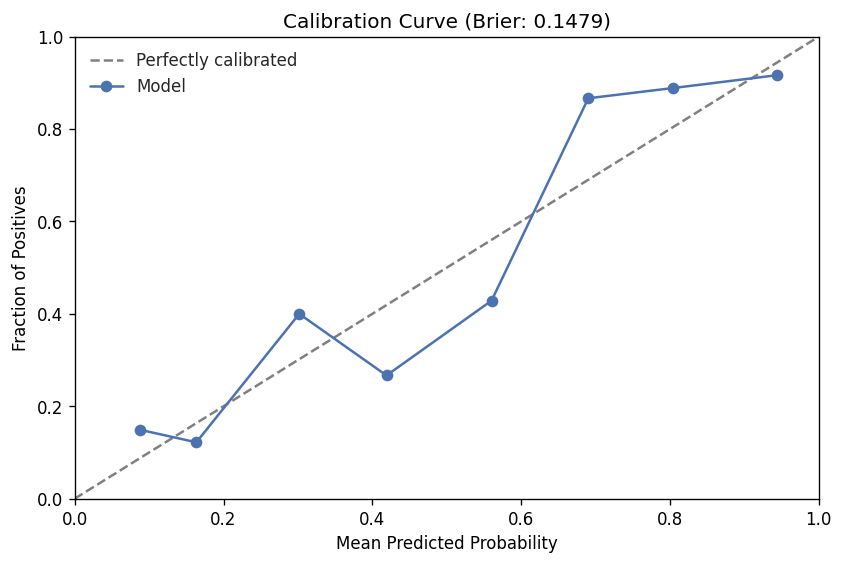
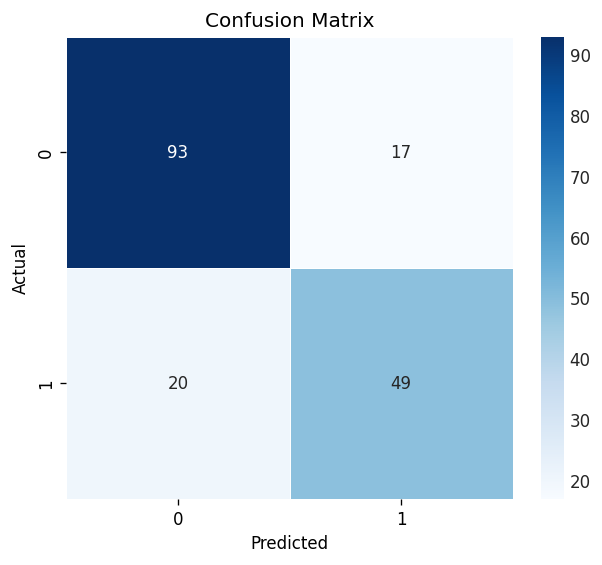
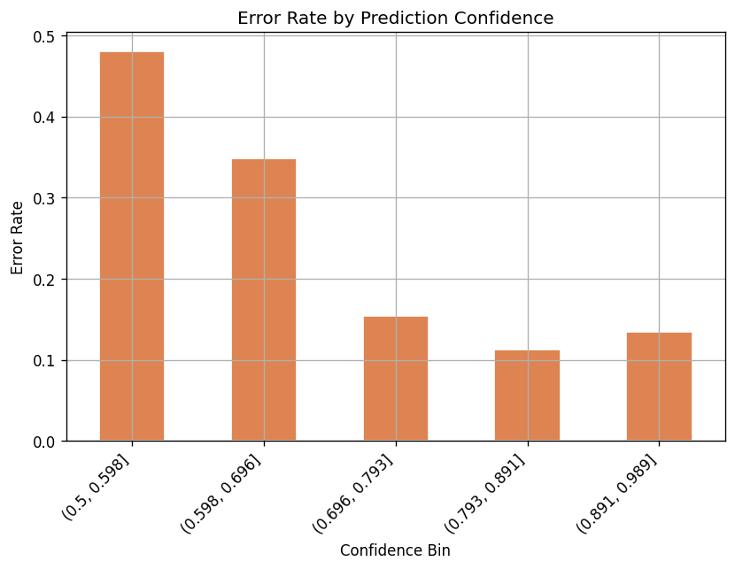
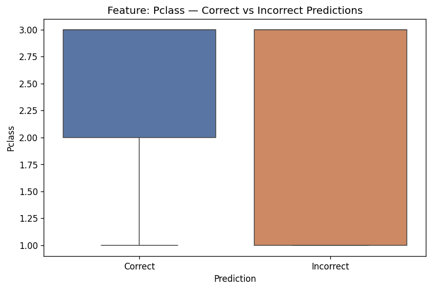
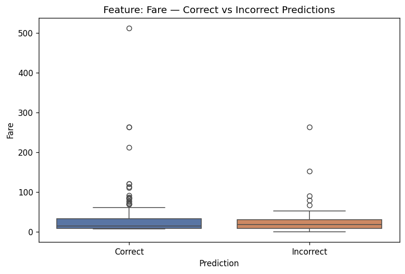
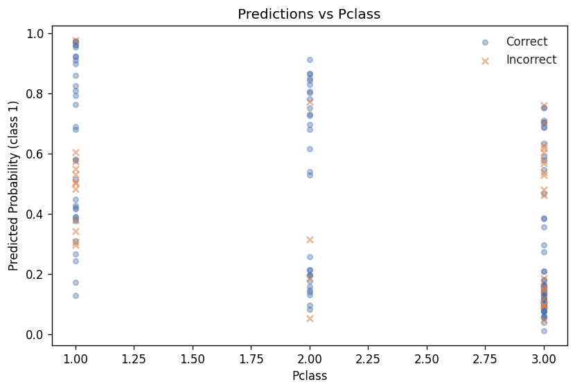
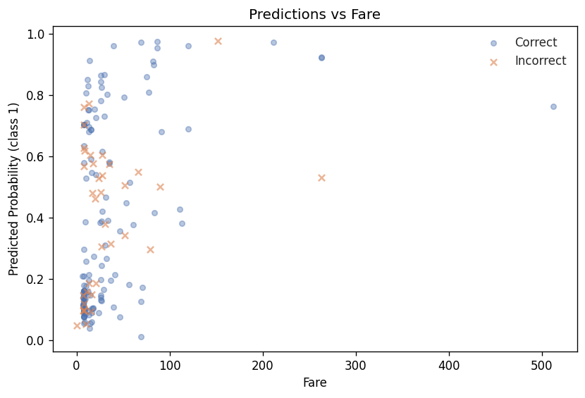
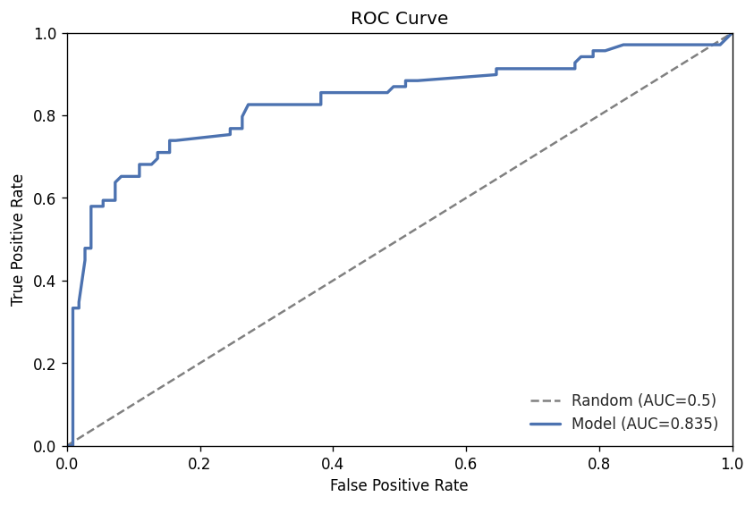
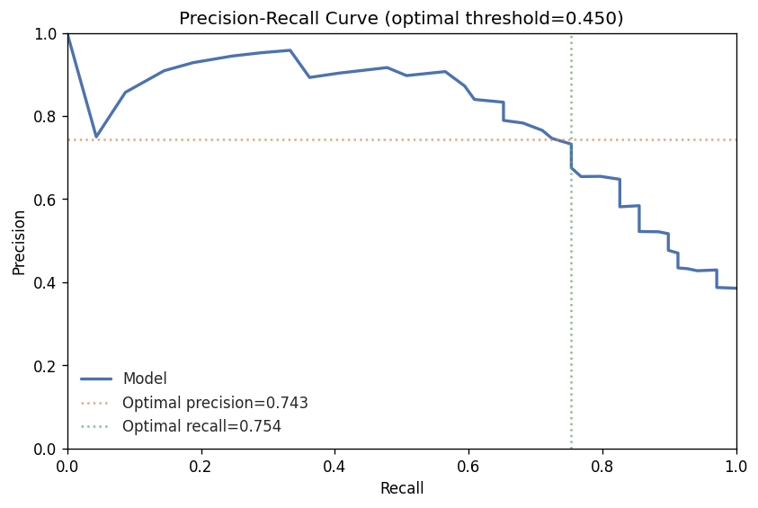
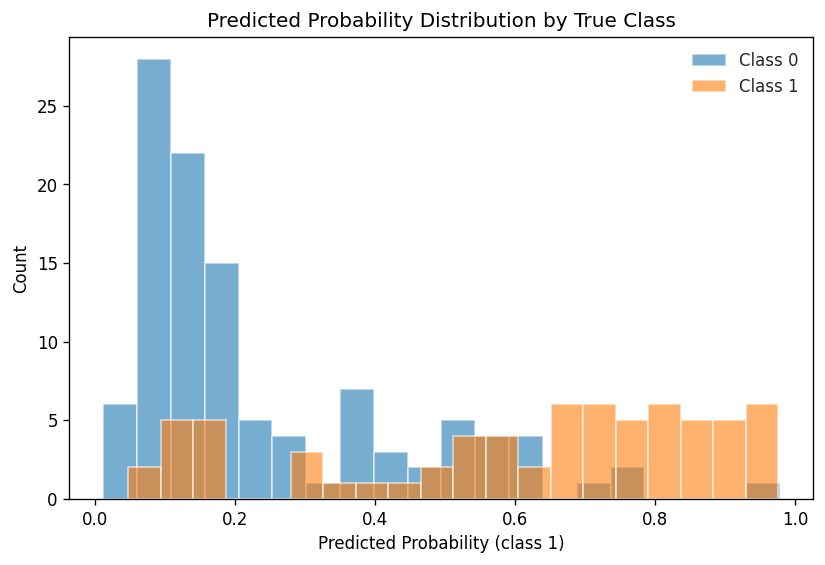

# Model Report — Iteration 1

## Summary

Iteration 1 establishes the baseline with a Logistic Regression model on the Titanic survival task. The model achieves a validation AUC-ROC of 0.835 with low overfitting risk and no leakage signals. This is a solid first iteration, though the relatively wide confidence interval (0.761--0.897) on 179 validation samples means improvements under ~0.14 AUC may not be statistically meaningful.

## Headline Metrics

| Metric | Train | Validation |
|--------|------:|----------:|
| AUC-ROC | 0.8702 | **0.8349** |
| Accuracy | 0.8076 | 0.7933 |
| F1 | — | 0.7259 |
| Precision | — | 0.7424 |
| Recall | — | 0.7101 |

## Overfitting Analysis

The train/validation AUC-ROC gap is 0.035 (4.1%), classified as **low** severity. This is expected for a linear model with limited capacity -- Logistic Regression is inherently regularised by its simplicity. Learning curve trend is unavailable since this model does not support iterative training. There is no evidence of memorisation.

## Leakage Check

No leakage indicators detected. No metric is suspiciously high for a first-pass logistic model, and no feature importance anomalies were flagged. The strongest feature (Sex, coefficient 2.52) is a well-known survival predictor in the Titanic dataset, not a proxy for the target.

## Calibration

The Brier score is 0.148, which is reasonable for a baseline classifier. The reliability curve shows the model is moderately well-calibrated in the mid-range bins but tends to under-predict survival probability in the highest bins: predicted probabilities around 0.75--0.875 correspond to actual rates of roughly 0.87--0.92. This is typical for logistic regression on imbalanced-ish data without post-hoc calibration.

## Threshold Analysis

The optimal threshold is **0.45** (vs the default 0.50), yielding an F1 of 0.748 compared to 0.726 at default -- a gain of +0.022 F1. The lower threshold increases recall from 0.710 to 0.754 at a minor precision cost (0.742 to 0.743). For a survival prediction task where false negatives are arguably more costly, this shift is directionally sound, though the magnitude is modest.

## Bootstrap Confidence Intervals

Based on 1,000 bootstrap resamples of 179 validation samples (95% CI):

| Metric | Point Estimate | CI Lower | CI Upper | Width |
|--------|---------------:|---------:|---------:|------:|
| AUC-ROC | 0.8349 | 0.7609 | 0.8973 | 0.1364 |
| Accuracy | 0.7933 | 0.7318 | 0.8492 | 0.1174 |
| F1 | 0.7259 | 0.6325 | 0.8077 | 0.1752 |

The CI widths are non-trivial, reflecting the small validation set (179 samples). Future iterations should note that metric deltas below ~0.05 are likely within noise.

## Separation Quality

The model demonstrates **strong** class separation. The Kolmogorov-Smirnov statistic is 0.590 (p < 0.001), and the discrimination slope (mean predicted probability for positives minus negatives) is 0.369. Mean predicted probability is 0.607 for survivors and 0.238 for non-survivors. Histogram overlap is 36.8%, indicating clear but imperfect separation -- consistent with a linear model on a moderately difficult task.

## Segment Analysis

No segment-level breakdowns were computed for this iteration. This is expected for a first baseline run without pre-defined fairness or subgroup slicing.

## Error Analysis

The overall error rate is 20.67% (37 of 179 predictions incorrect).

**Confusion matrix:**

|  | Predicted Survived | Predicted Died |
|--|---:|---:|
| **Actually Survived** | 49 (TP) | 20 (FN) |
| **Actually Died** | 17 (FP) | 93 (TN) |

False negatives (20) outnumber false positives (17), meaning the model is slightly more likely to miss survivors than to falsely predict survival. This asymmetry aligns with the model's moderate recall (0.710).

**Error rate by prediction confidence:**

| Confidence | n | Error Rate |
|-----------|--:|----------:|
| 0.5--0.6 | 25 | 48.0% |
| 0.6--0.7 | 24 | 33.3% |
| 0.7--0.8 | 25 | 16.0% |
| 0.8--0.9 | 62 | 9.7% |
| 0.9--1.0 | 43 | 16.3% |

The 0.9--1.0 bin shows a notable uptick in error rate (16.3% vs 9.7% in 0.8--0.9). This means 7 of 43 very-high-confidence predictions are wrong -- a calibration concern worth monitoring. These high-confidence errors are where the model is most dangerously wrong.

## Hardest Samples

The five samples with the highest individual loss highlight where the model is most confidently incorrect:

| Index | True Label | Predicted | P(survived) | Loss |
|------:|:----------:|:---------:|------------:|-----:|
| 41 | 0 (died) | 1 (survived) | 0.977 | 3.789 |
| 99 | 1 (survived) | 0 (died) | 0.099 | 2.312 |
| 28 | 1 (survived) | 0 (died) | 0.118 | 2.137 |
| 2 | 1 (survived) | 0 (died) | 0.146 | 1.925 |
| 34 | 1 (survived) | 0 (died) | 0.149 | 1.904 |

Sample 41 is the single worst error: the model predicted 97.7% survival probability for a passenger who died. The remaining hardest samples are survivors the model was very confident would die. Investigating the feature profiles of these outliers may reveal systematic blind spots (e.g., unusual age/fare/class combinations that defy the linear decision boundary).

## Feature Importance

Feature importances from logistic regression coefficients (absolute value):

| Rank | Feature | Importance |
|-----:|---------|----------:|
| 1 | Sex | 2.523 |
| 2 | has_cabin | 0.796 |
| 3 | Pclass | 0.601 |
| 4 | Fare | 0.403 |
| 5 | Embarked_Q | 0.340 |
| 6 | SibSp | 0.335 |
| 7 | Embarked_S | 0.270 |
| 8 | Parch | 0.175 |
| 9 | Age | 0.040 |

Sex dominates by a factor of 3x over the next feature, consistent with domain knowledge ("women and children first"). Notably, Age ranks last despite its expected importance -- this suggests the Age feature may need better engineering (e.g., binning, interaction terms with Pclass or Sex) in future iterations.

## Residual vs Feature Analysis

Per-feature diagnostic plots for the top continuous features reveal where the model systematically over- or under-predicts:

- **Pclass**: The model's errors are not uniformly distributed across classes. Feature diagnostic and residual plots show how prediction accuracy varies by passenger class.
- **Fare**: The residual plot shows the model's error pattern across the fare distribution. High-fare passengers may have different survival dynamics that a linear model captures imperfectly.

## Comparison to Prior Runs

First iteration -- no prior comparison available.

## Risk Flags

No risk flags detected.

## Plots

| Plot | File |
|------|------|
| ROC Curve |  |
| Precision-Recall Curve |  |
| Confusion Matrix |  |
| Calibration Curve |  |
| Actual vs Predicted |  |
| Error Distribution |  |
| Feature Diagnostic -- Pclass |  |
| Feature Diagnostic -- Fare |  |
| Residual vs Pclass |  |
| Residual vs Fare |  |
