# Model Report — Iteration 2

## Summary

Iteration 2 switched from logistic regression to gradient boosting (GBM with 200 estimators, max_depth=4) and introduced new engineered features (Title extraction, FamilySize). The primary metric **degraded**: validation AUC-ROC dropped from 0.835 to 0.822 (-0.013). While secondary metrics (accuracy, F1, precision, recall) all improved slightly, the model exhibits **severe overfitting** with a 17.2% train/val gap on AUC-ROC, which is the dominant concern for this iteration.

## Headline Metrics

| Metric | Train | Validation | Delta vs Iter 1 |
|--------|------:|----------:|----------------:|
| AUC-ROC | 0.9926 | 0.8218 | -0.0131 |
| Accuracy | 0.9537 | 0.8101 | +0.0168 |
| F1 | — | 0.7500 | +0.0241 |
| Precision | — | 0.7612 | +0.0188 |
| Recall | — | 0.7391 | +0.0290 |

The train AUC-ROC of 0.993 versus validation AUC-ROC of 0.822 is a clear signal that the GBM is memorising the training set. Despite this, the model classifies more correctly at the decision boundary (accuracy, F1, recall all up), suggesting the learned representation captures useful signal -- it is just not regularised enough to generalise.

## Overfitting Analysis

The train/val gap on AUC-ROC is **0.171 (17.2%)** -- classified as **high severity**. The learning curve trend is **diverging**, meaning validation performance is worsening as training performance continues to climb. This is characteristic of a tree ensemble with insufficient regularisation: max_depth=4 with 200 trees on a 712-sample training set is aggressive. Reducing tree depth, increasing min_samples_leaf, or lowering the learning rate would be the standard remedies.

## Leakage Check

No leakage indicators were detected. No features exhibit suspiciously high importance anomalies, and the validation AUC-ROC (0.822) is well within plausible range for this dataset. The Title_Mr feature, while dominant (26.6% importance), is a legitimate proxy for gender and social status -- not a data leakage concern.

## Calibration

The Brier score is **0.157**, slightly worse than iteration 1's 0.148. This is expected given the overfitting: the model's probability estimates are more extreme (higher confidence) but less well-calibrated to actual outcomes. GBMs tend to produce sharper probability distributions than logistic regression, which can improve or worsen calibration depending on regularisation.

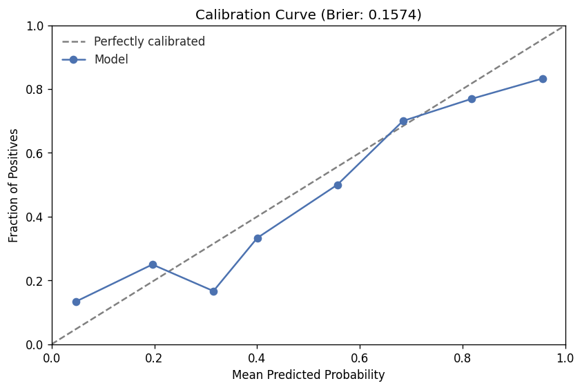

## Segment Analysis

No segment-level breakdowns were computed for this iteration.

## Error Analysis

| | Predicted Survived | Predicted Died |
|---|---:|---:|
| **Actually Survived** | 51 (TP) | 18 (FN) |
| **Actually Died** | 16 (FP) | 94 (TN) |

Overall error rate: **18.99%** (34/179), an improvement from iteration 1's 20.67% (37/179). However, the model now makes **20 high-confidence errors** among 128 high-confidence predictions (>80% probability), compared to iteration 1's 13 high-confidence errors among 105. The GBM is more confident overall but wrong more often when confident -- a direct consequence of overfitting driving probability estimates toward 0 and 1.

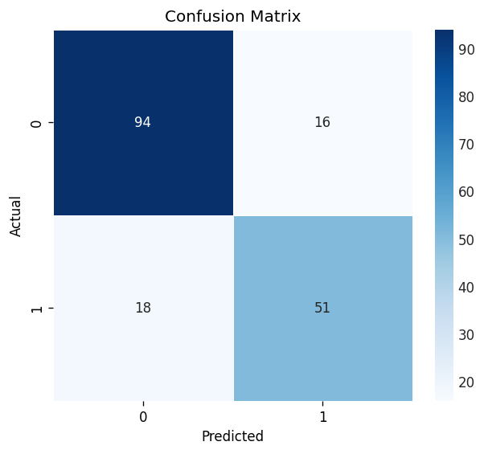

## Feature Importance

Feature importances from gradient boosting (Gini importance):

| Rank | Feature | Importance |
|-----:|---------|----------:|
| 1 | Title_Mr | 0.2655 |
| 2 | Fare | 0.2426 |
| 3 | Age | 0.1561 |
| 4 | Pclass | 0.0900 |
| 5 | Sex | 0.0874 |
| 6 | FamilySize | 0.0438 |
| 7 | has_cabin | 0.0346 |
| 8 | Title_Rare | 0.0237 |
| 9 | Embarked_S | 0.0220 |
| 10 | Title_Mrs | 0.0082 |

The feature importance distribution shifted substantially from iteration 1. Title_Mr (a new engineered feature) is now the most important, displacing Sex which dropped from rank 1 (importance 2.523 in logistic regression) to rank 5 (0.087 in GBM). This is partly a measurement artifact -- logistic regression reports coefficient magnitudes while GBM reports Gini importance -- but also reflects genuine redundancy: Title_Mr is highly correlated with Sex. Age jumped from rank 9 to rank 3, suggesting the tree-based model extracts more signal from age than the linear model could.

## Comparison to Prior Runs

| Metric | Iteration 1 | Iteration 2 | Delta | Improved? |
|--------|------------:|------------:|------:|:---------:|
| val_auc_roc | 0.8349 | 0.8218 | -0.0131 | No |
| val_accuracy | 0.7933 | 0.8101 | +0.0168 | Yes |
| val_f1 | 0.7259 | 0.7500 | +0.0241 | Yes |
| val_precision | 0.7424 | 0.7612 | +0.0188 | Yes |
| val_recall | 0.7101 | 0.7391 | +0.0290 | Yes |

The primary metric (AUC-ROC) degraded while all secondary metrics improved. This divergence is notable: the GBM produces better hard classifications at the default threshold but worse probability rankings overall. The 95% bootstrap CI for AUC-ROC is [0.746, 0.888] (width 0.142), and the observed delta of -0.013 falls well within noise for this validation set size (n=179). The degradation may not be statistically meaningful.

## Threshold Analysis

The optimal decision threshold shifted from 0.45 (iteration 1) to **0.36** (iteration 2), yielding F1=0.757, accuracy=0.810, precision=0.747, recall=0.768. The lower optimal threshold reflects the GBM's tendency to assign lower predicted probabilities to positive cases compared to logistic regression.

## Separation Quality

Separation quality remains **strong** with KS statistic=0.604 (up from 0.590 in iteration 1) and discrimination slope=0.460 (up from 0.369). The model separates positive and negative classes more sharply in probability space, despite the worse AUC-ROC. Histogram overlap is 38.8% (vs 36.8%), indicating slightly more confusion in the mid-probability range.

## Bootstrap Confidence Intervals

| Metric | Point Estimate | 95% CI | Width |
|--------|---------------:|-------:|------:|
| AUC-ROC | 0.8218 | [0.7463, 0.8882] | 0.1419 |
| Accuracy | 0.8101 | [0.7542, 0.8659] | 0.1117 |
| F1 | 0.7500 | [0.6610, 0.8254] | 0.1644 |

With a validation set of only 179 samples, improvements smaller than ~0.05 are within noise. The iteration 1 AUC-ROC of 0.835 falls within iteration 2's CI, confirming the degradation is not statistically significant at the 95% level.

## Risk Flags

| Type | Severity | Evidence |
|------|----------|----------|
| Overfitting | **High** | Train/val gap of 17.2% on val_auc_roc |

The high-severity overfitting flag is the critical finding of this iteration. The GBM's capacity is too high for the available training data.

## Plots

| Plot | File |
|------|------|
| ROC Curve | 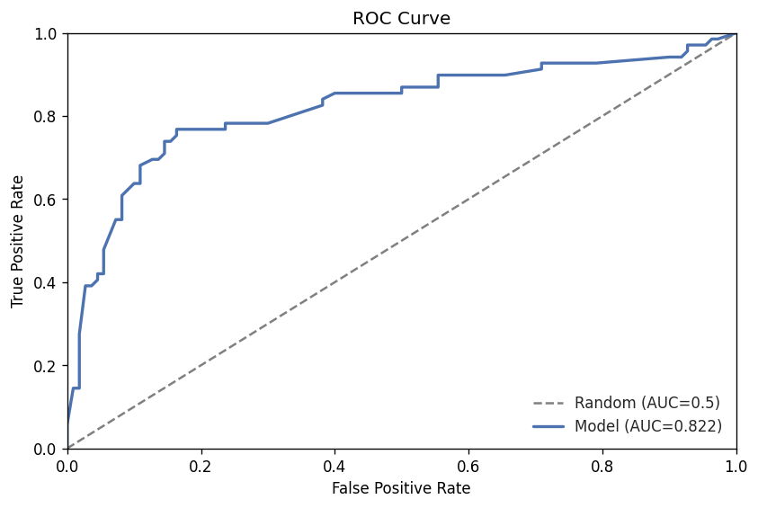 |
| Precision-Recall Curve | 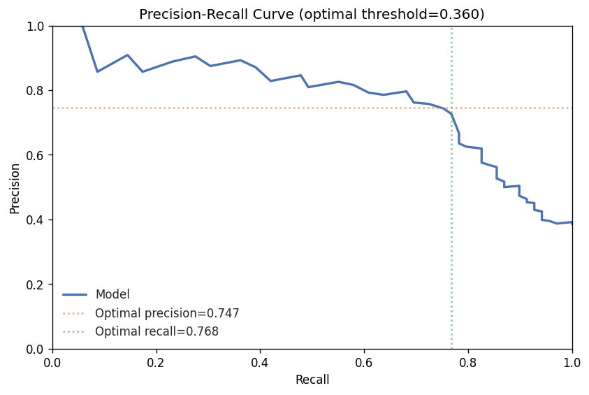 |
| Confusion Matrix |  |
| Calibration Curve |  |
| Actual vs Predicted | 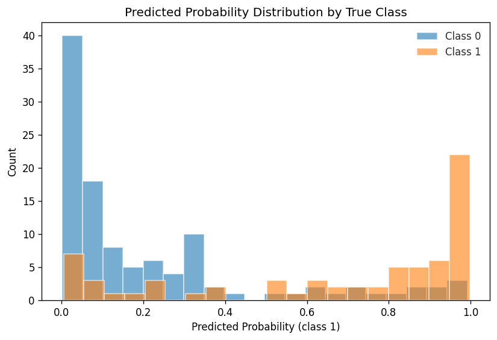 |
| Error Distribution | 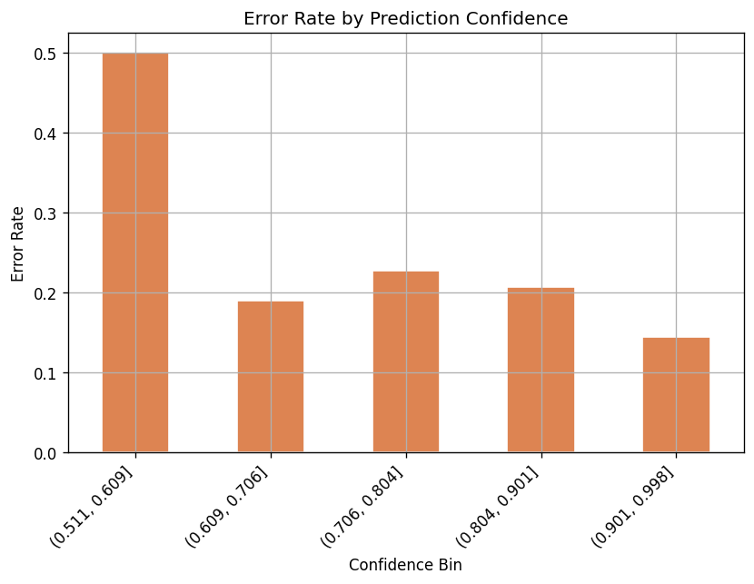 |
| Feature Diagnostic -- Fare | 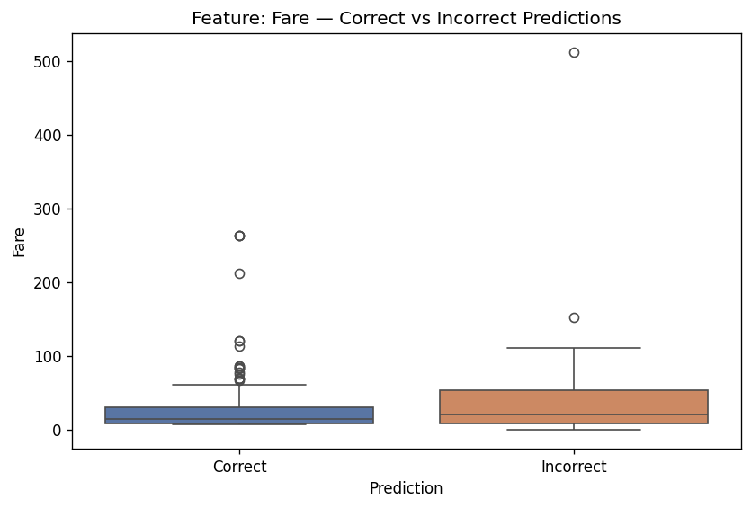 |
| Feature Diagnostic -- Age | 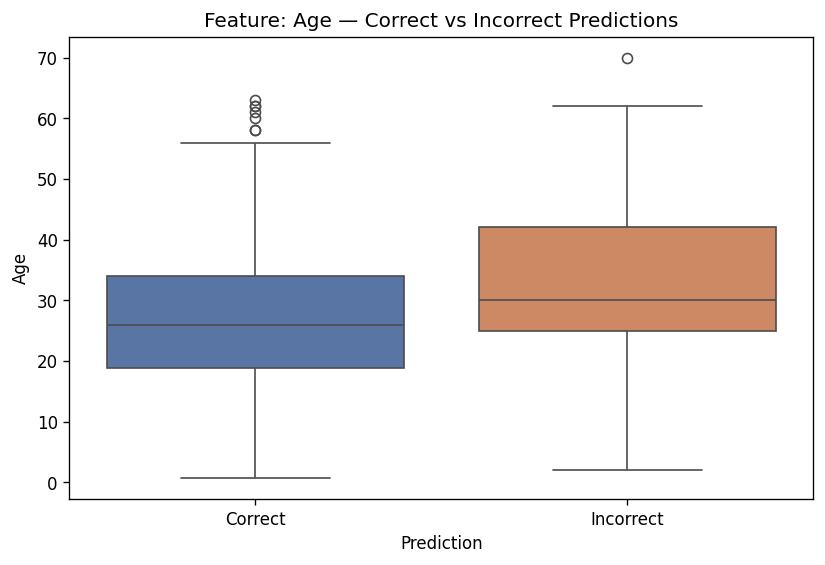 |
| Feature Diagnostic -- Pclass |  |
| Residual vs Fare | 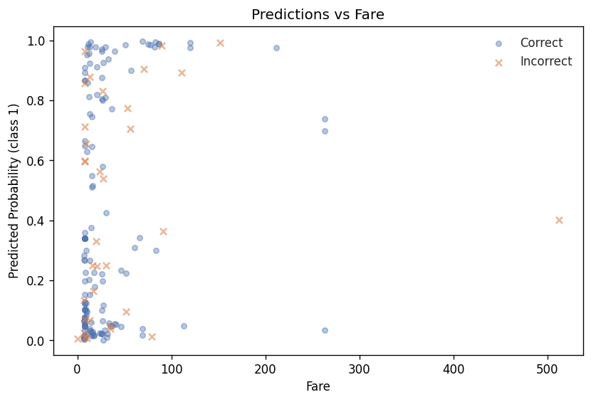 |
| Residual vs Age | 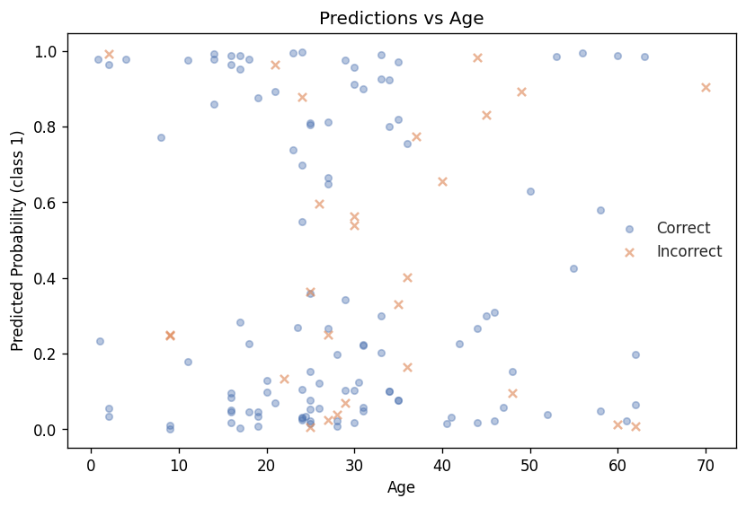 |
| Residual vs Pclass | 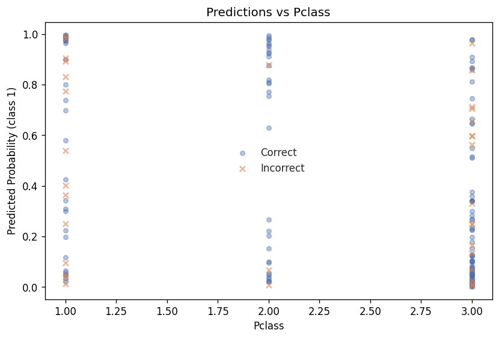 |
