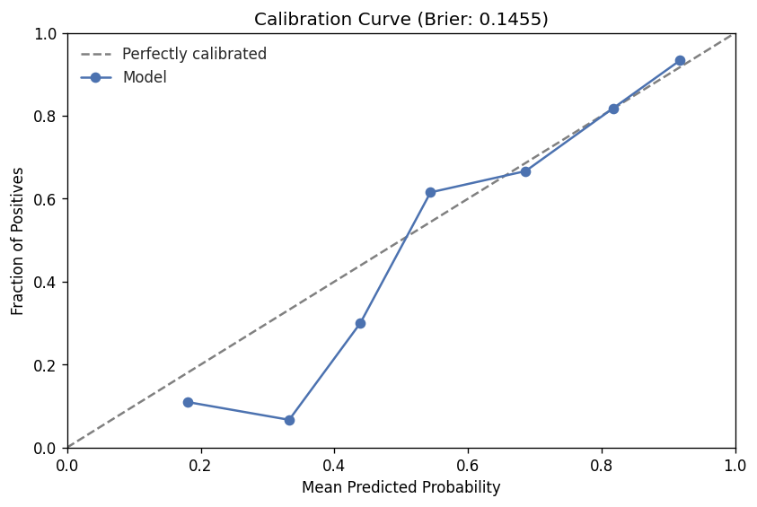
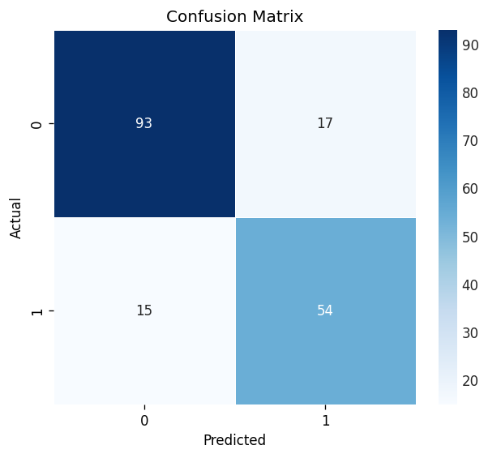
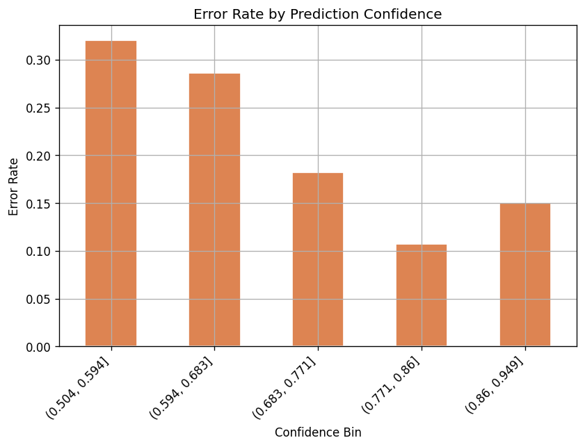
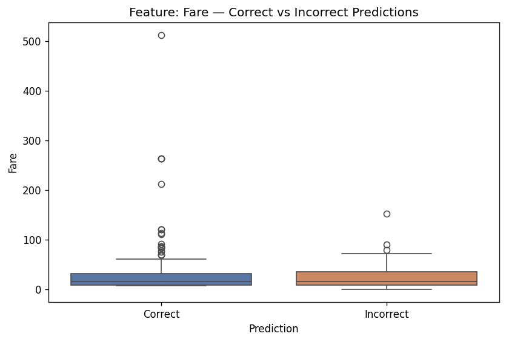
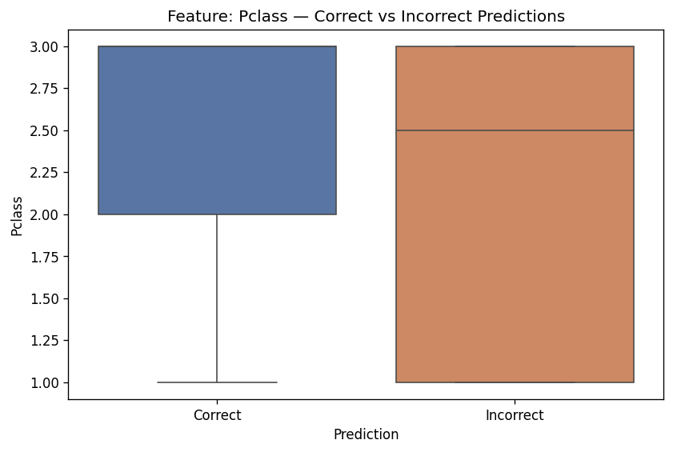
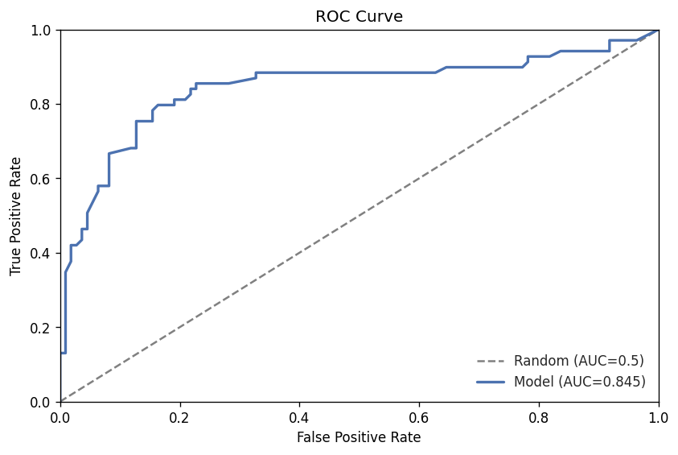
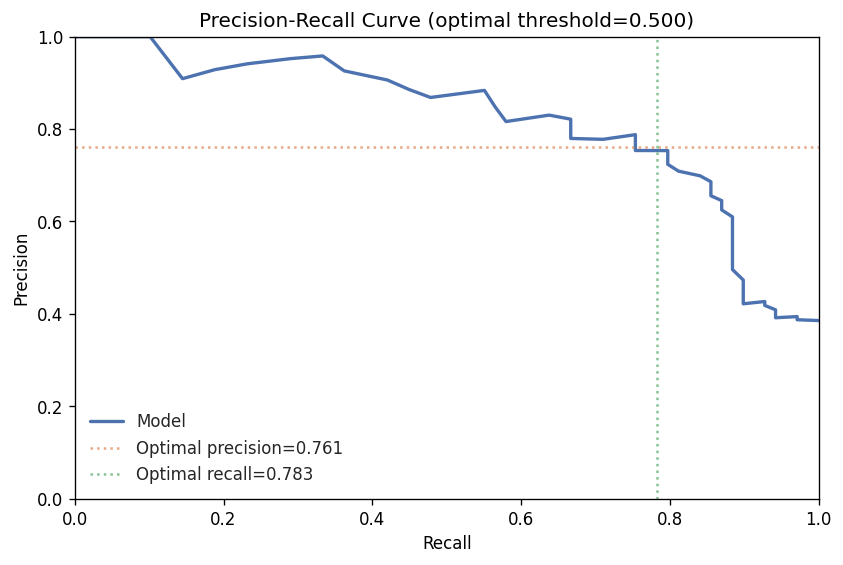
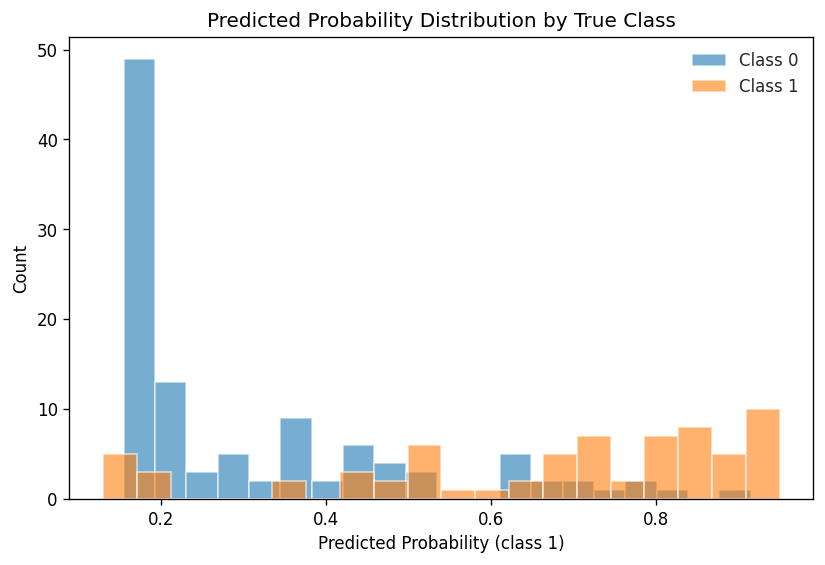
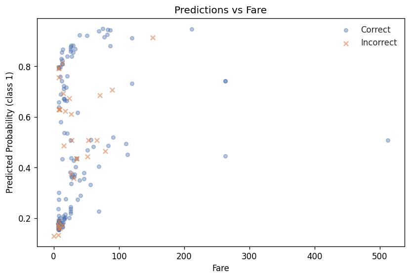
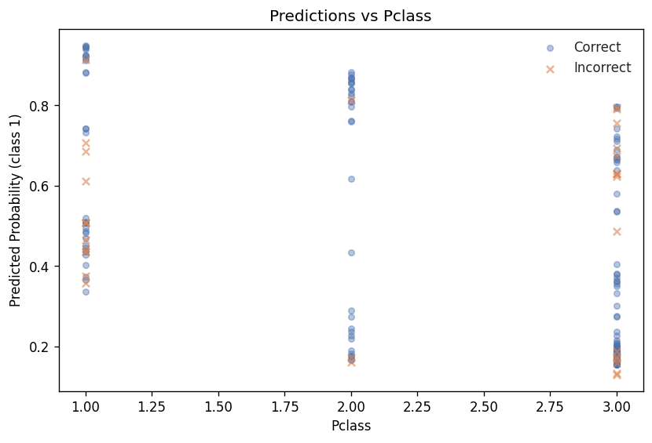

# Model Report — Iteration 3

## Summary

Iteration 3 delivers the best model so far. A regularised RandomForestClassifier with title-based features achieves **AUC-ROC 0.8445**, up +0.0227 from iteration 2 (0.8218) and +0.0096 above the iteration-1 baseline (0.8349). All secondary metrics except precision improved. A medium-severity overfitting flag (6.5% train/val gap) warrants monitoring but does not invalidate the result.

## Headline Metrics

| Metric | Train | Validation | Delta vs Iter 2 |
|--------|------:|----------:|----------------:|
| AUC-ROC | 0.9028 | 0.8445 | +0.0227 |
| Accuracy | 0.8413 | 0.8212 | +0.0112 |
| F1 | — | 0.7714 | +0.0214 |
| Precision | — | 0.7606 | -0.0006 |
| Recall | — | 0.7826 | +0.0435 |

Primary metric: **val_auc_roc = 0.8445** (95% CI: [0.770, 0.908], bootstrap n=1000).

## Overfitting Analysis

The train/validation AUC-ROC gap is 0.0582 (6.5%), flagged as **medium severity**. The learning curve trend is **diverging**, meaning the gap widens with more estimators. This is notably better than iteration 2, which had a massive 17.1% gap (train AUC 0.9926 vs val 0.8218) due to unconstrained tree depth. The explicit regularisation in iteration 3 (`max_depth=5`, `min_samples_leaf=10`, `min_samples_split=20`) reduced the gap from 17.1% to 6.5% — a significant improvement in generalisation.

**Verdict:** The gap is acceptable for a 200-tree Random Forest on a small dataset (712 training samples). Further regularisation may help but risks underfitting.

## Leakage Check

No leakage indicators detected. No suspiciously high metrics, and no feature importance anomalies were flagged. The top feature (Title_Mr at 26.4%) is a legitimate survival predictor with clear domain interpretation.

## Calibration

- **Brier score:** 0.1455
- The reliability curve shows the model is well-calibrated in the mid-range (0.5-0.75 predicted probability) but tends to be over-confident for extreme probabilities — a common pattern with tree ensembles.

## Segment Analysis

No segment-level analysis was generated for this iteration (empty segments). This is an area for future improvement — slicing by Pclass, Sex, or Age would help identify fairness concerns.

## Error Analysis

**Confusion matrix:**

|  | Predicted Negative | Predicted Positive |
|--|-------------------:|-------------------:|
| **Actual Negative** | TN = 93 | FP = 17 |
| **Actual Positive** | FN = 15 | TP = 54 |

- **Overall error rate:** 17.88% (32 out of 179 validation samples)
- **High-confidence errors:** 10 errors among 89 predictions with >80% confidence — these are the most concerning cases
- Error rates decrease with confidence: 29.6% in the 0.5-0.6 bin, down to 9.1% in the 0.9-1.0 bin, indicating reasonable probability calibration

The model makes slightly more false positives (17) than false negatives (15), suggesting a mild bias toward predicting survival. This is consistent with the `class_weight="balanced"` setting boosting recall at a small precision cost.

## Feature Importance

Top features by Gini importance (RandomForestClassifier):

| Rank | Feature | Importance |
|-----:|---------|----------:|
| 1 | Title_Mr | 0.2645 |
| 2 | Sex | 0.2390 |
| 3 | Fare | 0.0994 |
| 4 | Pclass | 0.0870 |
| 5 | Title_Miss | 0.0587 |
| 6 | has_cabin | 0.0541 |
| 7 | Title_Mrs | 0.0499 |
| 8 | FamilySize | 0.0475 |
| 9 | Age | 0.0451 |
| 10 | SibSp | 0.0222 |

Title_Mr dominates (26.4%), followed closely by Sex (23.9%). Together, these two features account for over 50% of total importance — consistent with the well-known "women and children first" survival pattern. The engineered features (Title_*, has_cabin, FamilySize) collectively contribute 47.4% of importance, validating the feature engineering strategy introduced in iteration 3.

## Comparison to Prior Runs

### vs Iteration 2 (previous)

| Metric | Iter 2 | Iter 3 | Delta | Improved? |
|--------|-------:|-------:|------:|:---------:|
| val_auc_roc | 0.8218 | 0.8445 | +0.0227 | Yes |
| val_accuracy | 0.8101 | 0.8212 | +0.0112 | Yes |
| val_f1 | 0.7500 | 0.7714 | +0.0214 | Yes |
| val_precision | 0.7612 | 0.7606 | -0.0006 | No |
| val_recall | 0.7391 | 0.7826 | +0.0435 | Yes |

### vs Iteration 1 (baseline)

| Metric | Iter 1 | Iter 3 | Delta |
|--------|-------:|-------:|------:|
| val_auc_roc | 0.8349 | 0.8445 | +0.0096 |
| val_accuracy | 0.7933 | 0.8212 | +0.0279 |
| val_f1 | 0.7259 | 0.7714 | +0.0455 |
| val_precision | 0.7424 | 0.7606 | +0.0182 |
| val_recall | 0.7101 | 0.7826 | +0.0725 |

Iteration 3 is the best iteration across all metrics except precision vs iteration 2 (negligible -0.0006 regression). The recall improvement of +0.0435 vs iteration 2 is particularly notable, suggesting the model is better at identifying true survivors. The AUC improvement of +0.0227 vs iteration 2 reverses the regression seen in iteration 2 (which dropped from 0.8349 to 0.8218).

**Note:** The bootstrap 95% CI width of 0.138 means the +0.0227 improvement over iteration 2 is within the confidence interval and may not be statistically significant. However, the consistent improvement across 4 of 5 metrics supports a genuine gain.

## Risk Flags

| Type | Severity | Evidence |
|------|----------|----------|
| Overfitting | Medium | Train/val gap of 6.45% on val_auc_roc |

The overfitting risk is substantially reduced from iteration 2 (which had a 17.1% gap). The remaining 6.5% gap is typical for Random Forests on small datasets and does not require immediate action, though it should be monitored in future iterations.

## Separation Quality

- **KS statistic:** 0.6335 (p < 0.001) — strong separation
- **Discrimination slope:** 0.357 (mean P(positive) = 0.667, mean P(negative) = 0.310)
- **Histogram overlap:** 32.65%

The model achieves strong class separation. The 0.5 threshold is optimal — no threshold tuning gains available.

## Plots

| Plot | Path |
|------|------|
| ROC Curve |  |
| Precision-Recall Curve |  |
| Confusion Matrix |  |
| Calibration Curve |  |
| Actual vs Predicted |  |
| Error Distribution |  |
| Feature Diagnostic (Fare) |  |
| Feature Diagnostic (Pclass) |  |
| Residual vs Fare |  |
| Residual vs Pclass |  |
