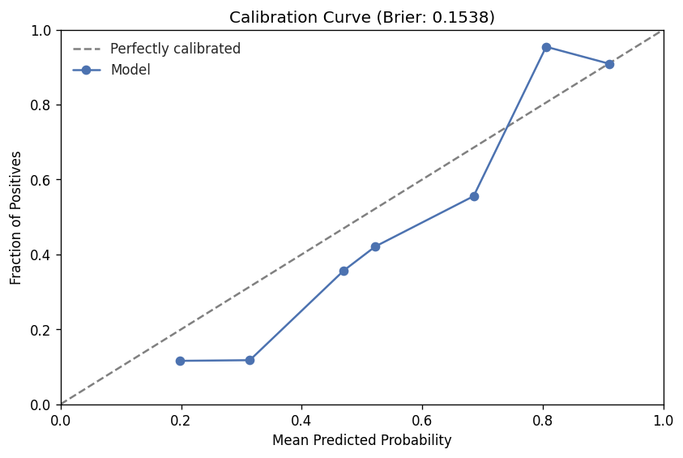
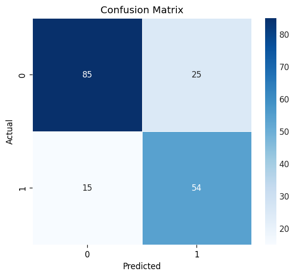
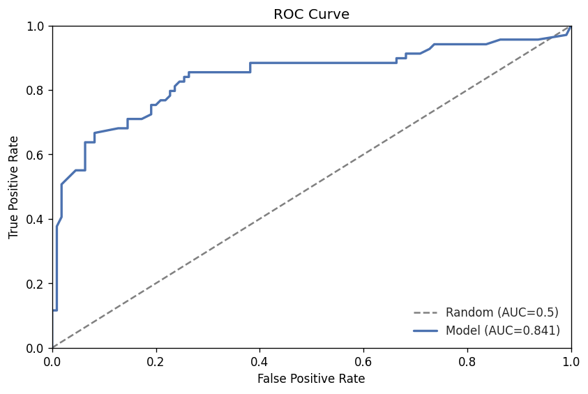
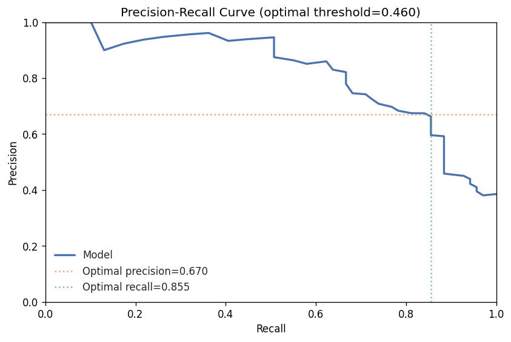
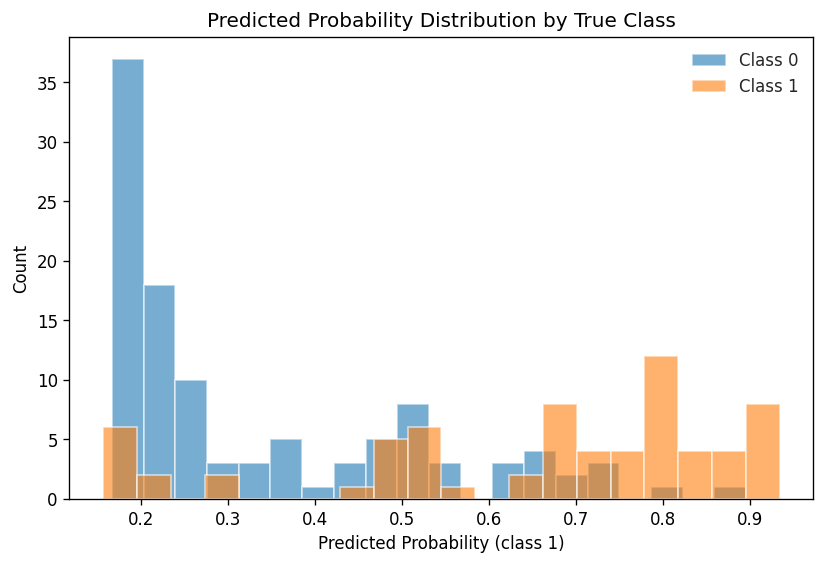
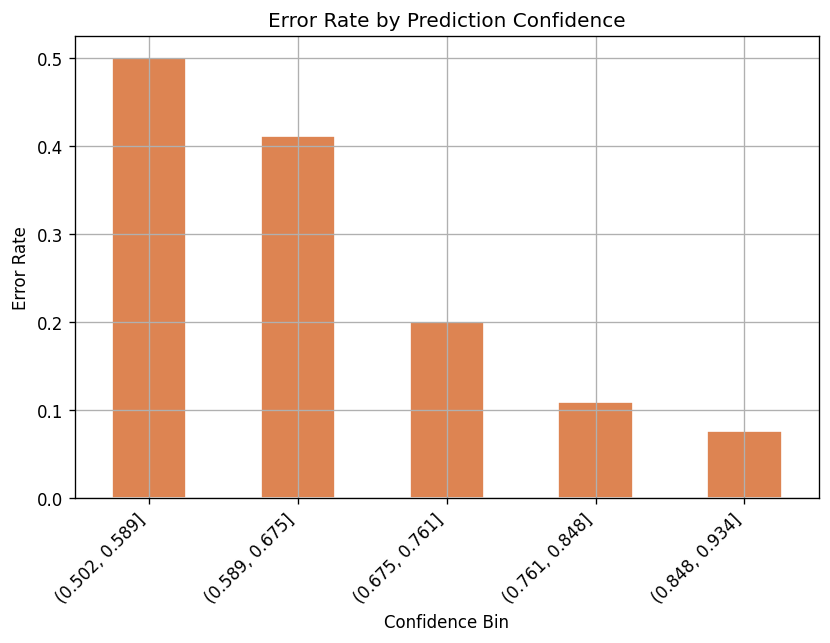
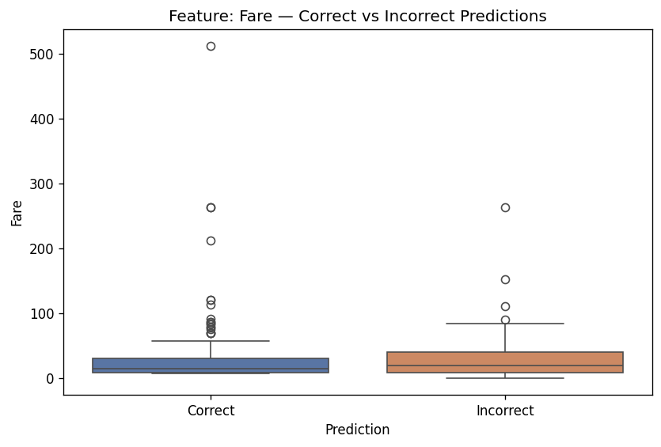
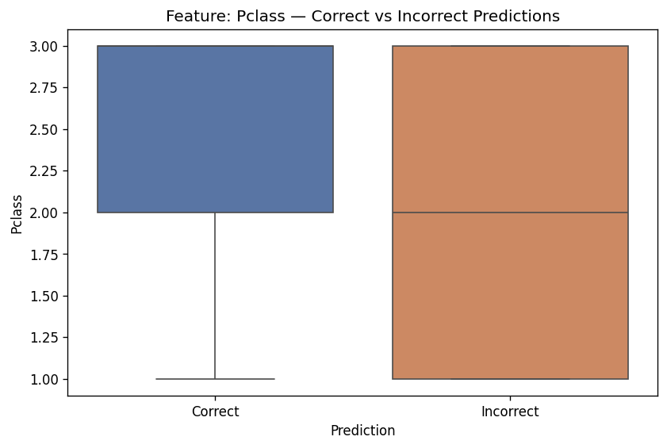
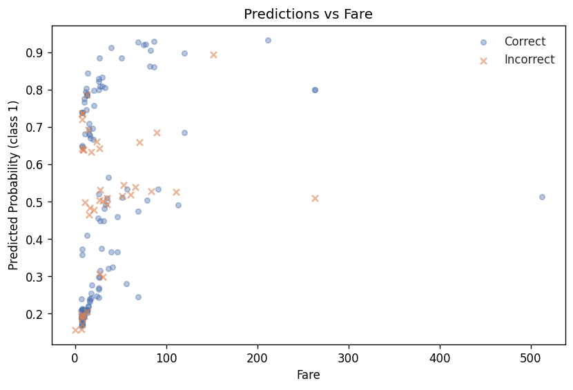
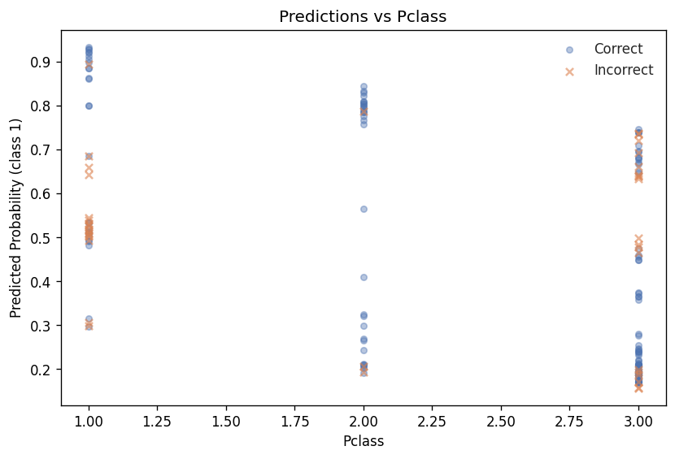

# Model Report — Iteration 4

## Summary

Iteration 4 used a RandomForestClassifier with regularisation constraints (max_depth=4, min_samples_leaf=15, min_samples_split=30) and engineered features including Title extraction, HasCabin, Deck, and FamilySize. The primary metric (val_auc_roc) slipped slightly to 0.8406 from 0.8445 in iteration 3 (delta -0.0039), and accuracy dropped more noticeably from 0.821 to 0.777. The overall verdict is **degraded** — the regularisation succeeded in reducing overfitting from high (iteration 2) to medium severity, but at the cost of worse generalisation on most metrics.

## Headline Metrics

| Metric | Train | Validation | Delta vs Iter 3 |
|--------|------:|----------:|----------------:|
| AUC-ROC | 0.8894 | 0.8406 | -0.0039 |
| Accuracy | 0.8287 | 0.7765 | -0.0447 |
| F1 | — | 0.7297 | -0.0417 |
| Precision | — | 0.6835 | -0.0770 |
| Recall | — | 0.7826 | 0.0000 |

The primary metric (AUC-ROC) barely moved, but accuracy and precision both declined materially. Recall held steady at 0.783.

## Overfitting Analysis

- **Train/val gap (AUC-ROC):** 0.0488 (5.5%) — severity: **medium**
- **Learning curve trend:** diverging

The gap dropped substantially from iteration 2's 17.2% to 5.5%, confirming that the tighter regularisation (max_depth=4, min_samples_leaf=15) effectively controlled overfitting. However, the diverging learning curve suggests the model may still benefit from more data or a different regularisation strategy. The trade-off here was reduced capacity: the model underfits slightly, which explains the accuracy drop.

## Leakage Check

No leakage indicators detected. No suspiciously high metrics and no feature importance anomalies.

## Calibration

- **Brier score:** 0.1538

The reliability curve shows reasonable calibration in the 0.7-0.9 predicted probability range (fraction positive tracks mean predicted well). However, the model is notably over-confident in the low-probability bins — predictions around 0.19-0.31 have actual positive rates of only 0.12, indicating the model overestimates survival probability for passengers it considers unlikely survivors. This is worse than iteration 3's Brier score of 0.1455.

## Segment Analysis

No segment-level analysis was generated for this iteration. Future iterations should add slicing by Pclass, Sex, or Age to identify fairness concerns and subgroup performance gaps.

## Error Analysis

**Confusion matrix:**

|  | Predicted Negative | Predicted Positive |
|--|-------------------:|-------------------:|
| **Actual Negative** | TN = 85 | FP = 25 |
| **Actual Positive** | FN = 15 | TP = 54 |

- **Overall error rate:** 22.35% (40/179) — up from iteration 3
- **High-confidence errors:** 8 errors among 64 high-confidence predictions (>80%)

Error rate by confidence band:

| Confidence | n | Error Rate |
|-----------|--:|----------:|
| 0.5-0.6 | 33 | 48.5% |
| 0.6-0.7 | 28 | 35.7% |
| 0.7-0.8 | 54 | 11.1% |
| 0.8-0.9 | 57 | 14.0% |
| 0.9-1.0 | 7 | 0.0% |

The model is weakest in the 0.5-0.7 confidence range, where nearly 40% of predictions are wrong. Above 0.7 confidence, the error rate drops sharply. The increase in false positives (25, up from iteration 3) drives the precision drop.

## Feature Importance

Top features by Gini importance (RandomForestClassifier):

| Rank | Feature | Importance |
|-----:|---------|----------:|
| 1 | Sex | 0.2382 |
| 2 | Title_Mr | 0.2256 |
| 3 | Title_Miss | 0.0864 |
| 4 | Fare | 0.0807 |
| 5 | Pclass | 0.0748 |
| 6 | Title_Mrs | 0.0693 |
| 7 | HasCabin | 0.0689 |
| 8 | Deck_Unknown | 0.0471 |
| 9 | FamilySize | 0.0365 |
| 10 | Age | 0.0255 |

Sex and Title_Mr together account for 46% of total importance, which makes sense given their high correlation with survival. The Title-based features (Mr, Miss, Mrs) collectively contribute 38% of importance, confirming that title engineering adds genuine signal beyond raw Sex. HasCabin (rank 7) captures some socioeconomic signal that Pclass alone misses.

## Comparison to Prior Runs

| Metric | Iteration 3 | Iteration 4 | Delta | Improved? |
|--------|----------:|----------:|------:|:---------:|
| AUC-ROC | 0.8445 | 0.8406 | -0.0039 | No |
| Accuracy | 0.8212 | 0.7765 | -0.0447 | No |
| F1 | 0.7714 | 0.7297 | -0.0417 | No |
| Precision | 0.7606 | 0.6835 | -0.0770 | No |
| Recall | 0.7826 | 0.7826 | 0.0000 | No |

Every metric either declined or remained flat. The most significant regression is precision (-7.7 percentage points), meaning the model now generates substantially more false positives. The regularisation constraints were too aggressive — they reduced overfitting but also reduced the model's ability to discriminate.

## Risk Flags

| Type | Severity | Evidence |
|------|----------|----------|
| Overfitting | Medium | Train/val gap of 5.49% on val_auc_roc |

While overfitting severity improved from "high" (iteration 2) to "medium", the model trades this for worse generalisation. The diverging learning curve combined with the accuracy drop suggests the regularisation went too far in one direction.

## Plots

| Plot | Path |
|------|------|
| ROC Curve |  |
| Precision-Recall Curve |  |
| Confusion Matrix |  |
| Calibration Curve |  |
| Actual vs Predicted |  |
| Error Distribution |  |
| Feature Diagnostic (Fare) |  |
| Feature Diagnostic (Pclass) |  |
| Residual vs Fare |  |
| Residual vs Pclass |  |
