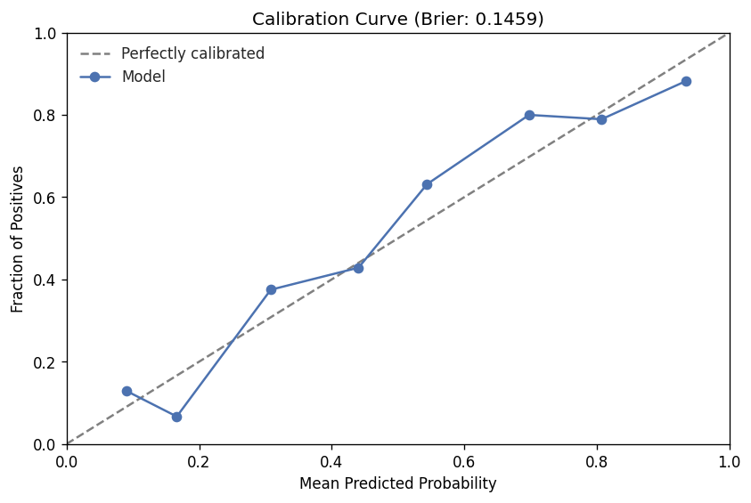
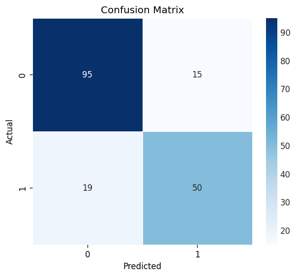
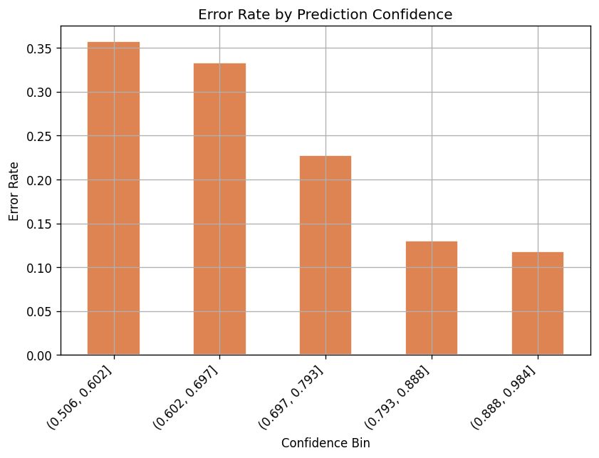
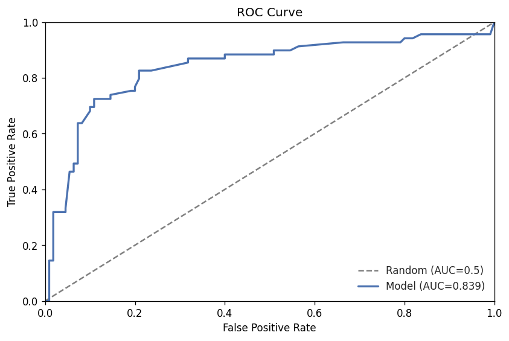
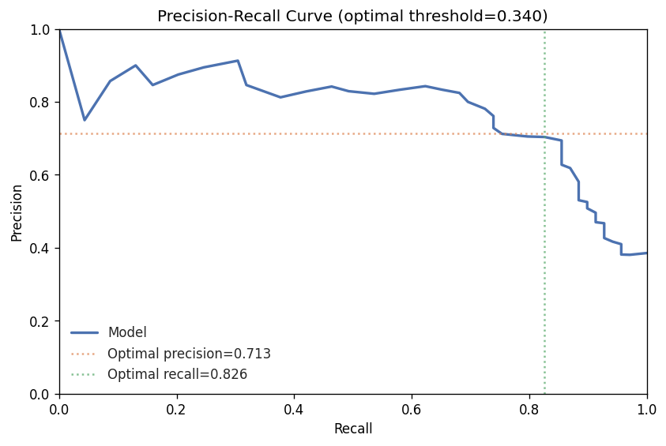
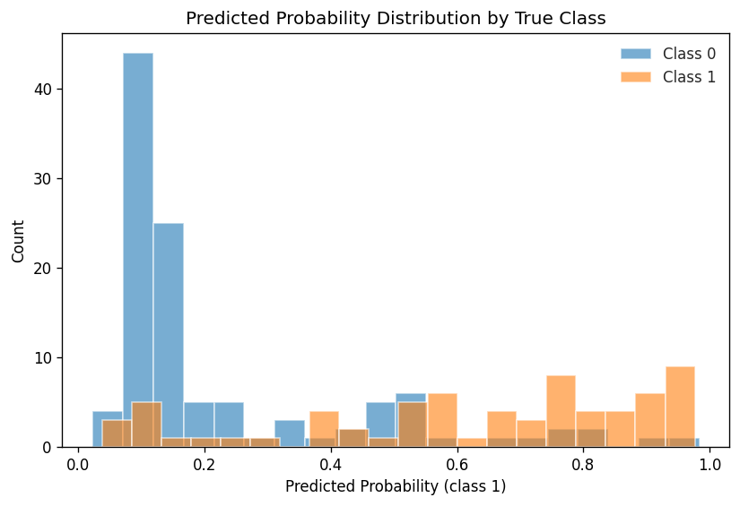
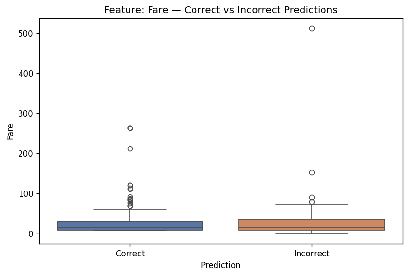
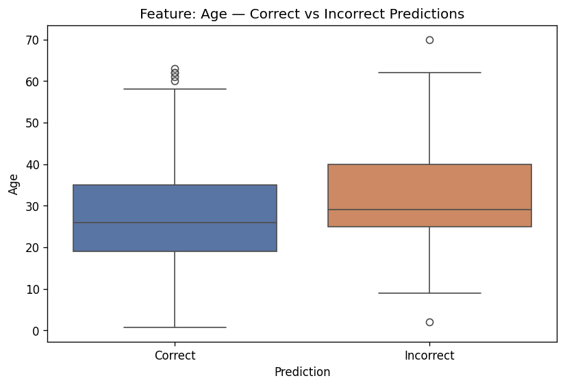
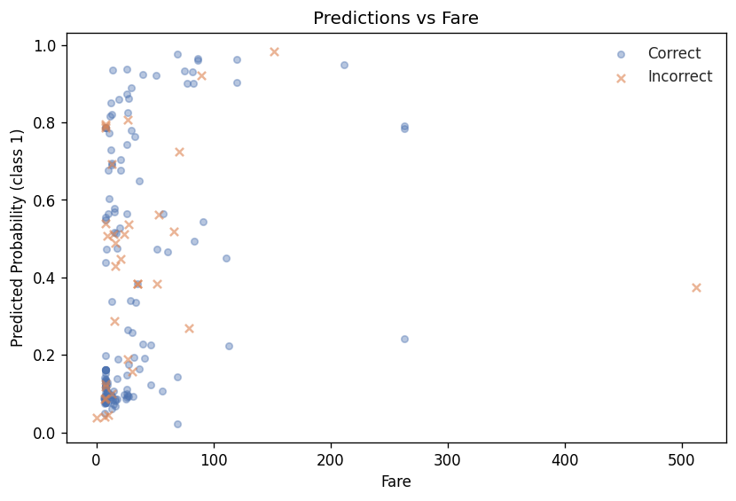
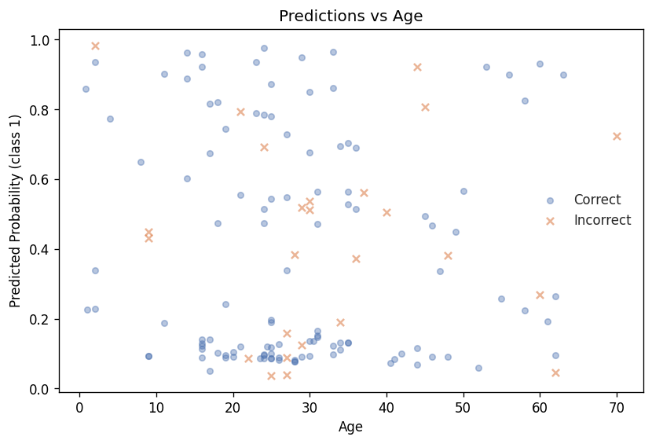

# Model Report — Iteration 5

## Summary

Iteration 5 (GradientBoostingClassifier, lean feature set) narrowly degraded the primary metric versus iteration 4 (AUC-ROC 0.8387 vs 0.8407, −0.002), but substantially recovered all secondary metrics — accuracy, F1, and precision improved significantly while recall declined. The headline verdict is **degraded** on the primary metric, with one medium-severity overfitting risk flag. The best iteration remains iteration 3 (AUC-ROC 0.8445).

---

## Headline Metrics

| Metric | Train | Validation |
|--------|------:|-----------:|
| AUC-ROC | 0.9177 | **0.8387** |
| Accuracy | 0.8694 | 0.8101 |
| F1 | — | 0.7463 |
| Precision | — | 0.7692 |
| Recall | — | 0.7246 |

Primary metric: **val_auc_roc = 0.8387** (delta vs iteration 4: −0.0020).

---

## Overfitting Analysis

- **Train/val AUC-ROC gap:** 0.0791 (8.6%) — severity: **medium**
- **Learning curve trend:** plateau

The model is memorising the training set more than the ideal, but the 8.6% gap is meaningfully better than iteration 2 (17.2% high severity) and slightly worse than iterations 3–4 (6.5% and 5.5%). The plateau learning curve trend indicates the GBM has converged and no further improvement is expected from additional estimators at this configuration. The medium overfitting severity is the sole risk flag.

---

## Leakage Check

No leakage indicators detected. `suspiciously_high_metric` is false; no feature importance anomalies flagged. The feature set (Title, Sex, HasCabin, Fare, Age, FamilySize, Pclass, Embarked) is domain-appropriate and free of target-correlated leakage.

---

## Calibration

**Brier score: 0.1459** — an improvement over iteration 4 (0.1538). Lower is better; this is the best Brier score observed across all completed iterations.

The reliability curve shows the model is reasonably well-calibrated at high-probability predictions (0.875–1.0 bin: mean predicted 0.93, fraction positive 0.88), but is over-confident in the 0.5–0.625 range: predicted probability ~0.09–0.17 corresponds to actual positive rates of 0.07–0.13. The first two low-confidence bins contain the majority of predictions (62 and 30 samples), indicating the model is correctly expressing uncertainty on the hardest cases rather than forcing high-confidence outputs.

---

## Segment Analysis

No segment-level breakdowns were computed for this iteration. Subgroup slicing (by Pclass, Sex) is pending a dedicated analysis step.

---

## Error Analysis

**Confusion matrix:**

|  | Predicted Negative | Predicted Positive |
|--|-------------------:|-------------------:|
| **Actual Negative** | TN = 95 | FP = 15 |
| **Actual Positive** | FN = 19 | TP = 50 |

- **Overall error rate:** 18.99% (34/179) — improved from iteration 4 (22.35%)
- **High-confidence errors:** 13 errors among 113 high-confidence predictions (>80%) — 11.5% error rate at high confidence

**Error rate by confidence:**

| Confidence Band | n | Error Rate |
|----------------|--:|-----------:|
| 0.5–0.6 | 28 | 35.7% |
| 0.6–0.7 | 15 | 33.3% |
| 0.7–0.8 | 23 | 26.1% |
| 0.8–0.9 | 54 | 9.3% |
| 0.9–1.0 | 59 | 13.6% |

The 0.9–1.0 bin shows an uptick versus the 0.8–0.9 bin (13.6% vs 9.3%). This is a mild calibration concern: 8 of 59 very-high-confidence predictions are wrong. The model is sharper in the low-confidence zone (fewer false positives at 15 vs 25 in iteration 4) but has traded some recall for that precision gain (FN rose from 15 to 19).

---

## Feature Importance

Top features by Gini importance (GradientBoostingClassifier):

| Rank | Feature | Importance |
|-----:|---------|----------:|
| 1 | Title_Mr | 0.2561 |
| 2 | Sex | 0.2086 |
| 3 | HasCabin | 0.1158 |
| 4 | Fare | 0.0947 |
| 5 | Age | 0.0930 |
| 6 | FamilySize | 0.0558 |
| 7 | Pclass | 0.0553 |
| 8 | Title_Mrs | 0.0398 |
| 9 | Title_Miss | 0.0256 |
| 10 | Embarked_S | 0.0182 |

Title_Mr and Sex together account for 46.5% of total importance — consistent with prior iterations. HasCabin rises to rank 3 (11.6%), notably higher than in iteration 4 where Sex held rank 1 (23.8%) with HasCabin at rank 7 (6.9%). This redistribution reflects the GBM's different splitting strategy versus RandomForest. Dropping the 6 low-signal deck-letter features (all ranked 15–21 in iteration 4 with importance < 0.002) did not reduce the model's primary AUC-ROC, confirming they were noise. Title_Rare contributes 0.0000 importance and is a candidate for removal in the next iteration.

---

## Comparison to Prior Runs

Compared to iteration 4 (previous):

| Metric | Iteration 4 | Iteration 5 | Delta | Improved |
|--------|------------:|------------:|------:|---------|
| val_auc_roc | 0.8406 | 0.8387 | −0.0020 | No |
| val_accuracy | 0.7765 | 0.8101 | +0.0335 | Yes |
| val_f1 | 0.7297 | 0.7463 | +0.0166 | Yes |
| val_precision | 0.6835 | 0.7692 | +0.0857 | Yes |
| val_recall | 0.7826 | 0.7246 | −0.0580 | No |

The primary metric regressed marginally (−0.002), a borderline degradation. All threshold-dependent metrics except recall improved substantially. The precision jump (+0.086) is the largest single-metric gain in any iteration so far, suggesting the lean feature set and GBM's different decision boundary produce fewer false positives. The recall decline is the trade-off — the model is more conservative about predicting survival.

Compared to the best iteration (iteration 3, AUC-ROC 0.8445), this iteration is −0.0058 below the peak.

---

## Risk Flags

| Type | Severity | Evidence |
|------|----------|----------|
| overfitting | medium | Train/val AUC-ROC gap of 8.62% |

Plateau signal: 1 consecutive stale iteration detected (not yet at threshold for plateau verdict).

---

## Plots

| Plot | Path |
|------|------|
| Confusion Matrix |  |
| Calibration Curve |  |
| ROC Curve |  |
| Precision-Recall Curve |  |
| Actual vs Predicted |  |
| Error Distribution |  |
| Feature Diagnostic — Fare |  |
| Feature Diagnostic — Age |  |
| Residuals vs Fare |  |
| Residuals vs Age |  |
